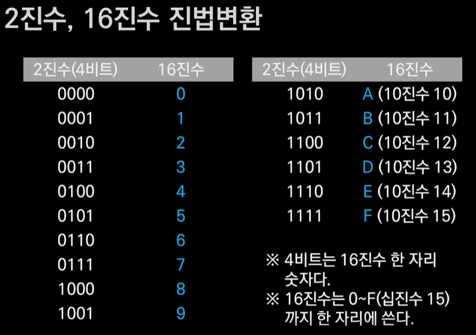
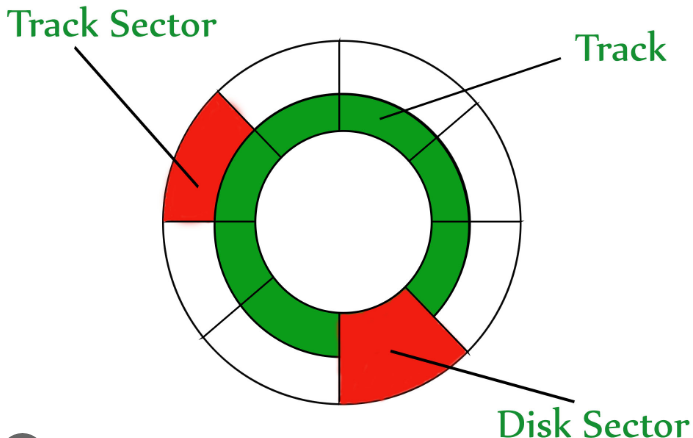

# study-computer-science-for-beginners
## 인프런 넓고 얕게 외워서 컴공 전공자되기 강의 정리

# 섹션 0. 학습에 앞서 본 강의 소개
### 다나와 사이트에서 컴퓨터에 대한 어휘를 익히기
- CPU, 메인보드 쪽은 자세하게 알아두기

# 섹션 1. 컴공 이론을 위한 기초체력 다지기
## 1비트와 디지털
### 1bit와 수(다른 말로 디지털)
- 1비트란 '전기 스위치 1개'를 의미한다.
- 전기가 흐르는 On 상태는 1이다.
- 전기가 흐르지 않는 Off 상태는 0이다.

### 스위치 4개를 조합해서 4bit
bit -> 경우의 수 (0,1 -> 총 2가지)
- 4bit = 2의 4승 = 16

## 4비트와 16진수 그리고 진법변환
### 2진수, 16진수 진법변환

- 4비트는 16진수 한 자리 숫자다.
- 16진수는 0~F(십진수 15)까지 한 자리에 쓴다.

## 16진수 표기가 사용되는 예
### 16진수 표기가 사용되는 예
- 색상 표현 (RGB)
- 컴퓨터 하드웨어 주소 표현
- 메모리 값 표현

## 외워야 할 단위 체계와 숫자
### 외워야 할 단위 체계 #1
- 8개 비트를 하나로 묶어 1 바이트(byte)라고 한다.
- 1바이트는 영문자 한 글자가 저장될 수 있는 메모리 크기이며 관리의 최소 단위이다. (한글 한 글자를 저장하려면 2바이트가 필요하다.)
- computer 는 CPU + RAM 으로 이루어져있다고 해도 과언이 아니다.
### 외워야 할 단위 체계 #2
- 4비트는 16가지, 8비트는 256가지, 16비트는 65,536가지 (64KB)이다. 
- 2의 10제곱은 1024이다.

## 컴퓨터가 글자를 다루는 방법
- 십진수 65 (컴퓨터에겐 영문 대문자'A')
- 16진수로는 0x41
- ASCII(American Standard Code for Information Interchage)는 미국에서 사용하는 표준 코드 체계이다.
- 숫자와 글자를 구별하지 않고 정보를 말할 때는 바이너리(Binary)라고 한다.

## 컴퓨터가 사진을 다루는 방법
- 모니터 화면 상 '점' 하나를 화소(Pixel)이라 한다.
- 여러 점들을 모아 사진을 만들 수 있다.
- 화소 하나를 표현하는데 8비트, 16비트, 24비트, 32비트(투명도를 추가) 정보가 필요할 수 있다.
- bitmap : 각 픽셀의 정보를 일일이 나열한 것

# 섹션 2. 넓고 얕은 컴퓨터 구조

## 디지털 회로와 덧셈
- 스위치 하나에 1bit
### 컴퓨터가 덧셈 하는 방법
- 2진수 1+1은 2진수 10이다.
- A가 1, B가 1이면 XOR 연산 결과 S는 0이다.
- 동시에 A가 1, B가 1이면 AND 연산결과 C는 1이다. 이 1은 자리올림(Carry)이다.

## 컴퓨터가 뺄셈 하는 방법
- 6에 4를 더하면 10이다. 즉, 4는 6에 대한 10의 보수이다.
- 13 - 6은 7이다.
- 13에 6에 대한 10의 보수 4를 더하고 10의 자리에서 1을 빼도 역시 7이다.

- 2진수에서 0은 1로, 1은 0으로 뒤집으면 **1의 보수**가 된다.
- 1의 보수에 1을 더하면 **2의 보수**이다.
- 어떤 숫자에 2의 보수를 더하면 자동으로 2진수 뺄셈이 된다. 단, 자리올림은 버린다.

## CPU가 곱하고 나누는 방법
### 컴퓨터가 곱셈하는 방법
- 4비트로 5를 표현하면 0101이다.
- 4비트 0101을 왼쪽으로 한 칸씩 밀면(Shift) 1010이다.
- 맨 오른쪽에 0이 채워진다.(Padding)
- 4비트로 표현하는 2진수 1010은 10이다.
- 왼쪽으로 한 칸 밀면 곱하기 2, 두 칸 밀면 곱하기 4가 된다.

### 컴퓨터가 나눗셈 하는 방법
- 4비트로 6을 표현하면 0110이다.
- 4비트 0110을 오른쪽으로 한 칸씩 밀면 0011이다.
- 맨 왼쪽에 0이 채워진다.
- 4비트로 표현하는 2진수 0011은 3이다.

- 어떤 숫자를 0으로 나누는 것은 절대 안된다.

## 컴퓨터가 연산하는 과정
### CPU와 RAM (컴퓨터의 구성 요소)
- CPU : 연산장치(비메모리)
- RAM : 메모리(1차 메모리) - 메모리는 엑셀과 비슷하다.
  메모리에서 가져와서 CPU의 레지스터에 임시로 저장 후 연산한다.
1. RAM같은 메모리에서 정보를 가져온다
2. 그 정보를 레지스터로 옮겨온다.
3. ALU를 통해서 산술연산을 실시한다.
4. 그 결과를 다시 메모리에 저장한다.
- 32bit를 사용하면 4GB의 메모리를 사용할 수 있다.
- 2차 메모리는 HDD나 SSD 등이다.

## 컴퓨터가 기억공간을 관리하는 방법
(Computer - internal)(CPU) Register     
(Computer - internal)(CPU) L1, L2, L3 Cache memory     
(Computer - internal) RAM   
(external - storage) HDD, SSD, USB disk     
(external - storage) Backup device

밑으로 갈 수록 속도가 느려지고 가격이 저렴해진다.
- CPU가 앞으로 연산에 이용될 정보를 예측해서 메모리에서 가져와 캐시메모리에 저장한다.

### 컴퓨터가 기억공간을 관리하는 방법
- 컴퓨터는 기본적으로 모든 것이 다 '숫자'이다.
- 정보가 저장된 위치도 '숫자' (보통은 일련번호)로 표시한다. (메모리 주소)
- 이 같은 관리 체계는 아파트 단지에서 각 가구를 동, 호 숫자로 관리하는 것과 유사하다.
- 레지스터, 주 기억장치(RAM), 보조 기억장치(HDD, SSD)를 관리하는 방법은 조금씩 다르다.
  + 레지스터는 개별 기억공간마다 고유 이름을 붙인다.
  + 주 기억장치는 일련번호를 붙인다. - 이것이 메모리 주소임
  + 보조 기억장치는 트랙(Track) 번호와 섹터(Sector) 번호를 붙여 관리한다. (파일 (File)의 등장)

## HDD, SSD와 파일 시스템
### 주 기억장치 공간은 '일련번호'로 관리한다.
Register는 Name      
RAM은 주소 - 번호를 붙여 1byte (8bit) 단위로 관리

### HDD의 논리적 구조
**Track, Sector**

- Bad Sector : 10만 번 정도 overwrite(덮어쓰기)를 하다 보면 Sector를 더 이상 사용할 수 없게 된다. 그것을 Bad Sector라고 한다.

### 파일이 저장되는 방법 (파일 시스템)
File Allocation Table (FAT) - 파일 위치를 알려주는 테이블
- 0번 트랙, 0번 섹터 : Master Boot Recorder (MBR) - 운영체제 프로그램을 저장해두는 곳
- 빠른 포맷 : FAT를 지워버리는 것 / 느린 포맷 : 모든 트랙, 섹터에 0으로 overwrite

# 섹션 3. 넓고 얕은 운영체제
## 동시성과 병렬성
### 동시성 : 여러가지 일이 동시에 진행되는 것 
### 병렬성 : 같은 일을 여러 주체가 함께 동시에 진행하는 것
# 섹션 4. 프로그래밍 맛보기
# 섹션 5. 자료구조 소개와 마무리

